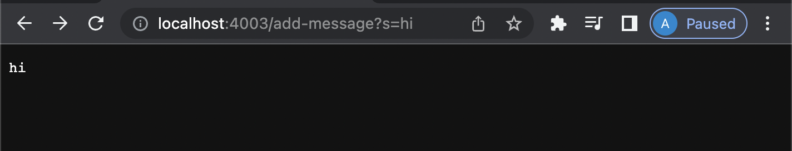
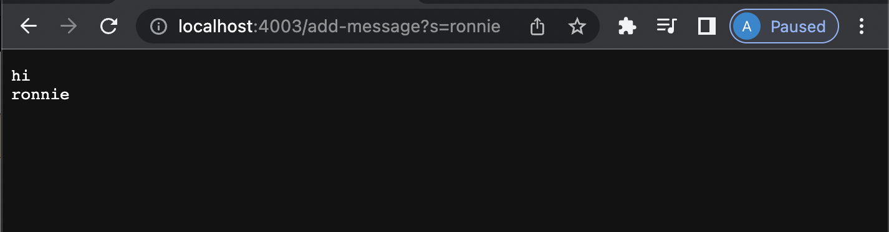

# **Lab Report 2 - Server and Bugs (Week 3)**

**Part 1:** String Server
This part of the lab report required me to create a new server called StringServer. When the path of the URL is changed, a string is displayed on the web page. If we further change the path of the URL, a new string is displayed in the next line along with the previous string. The image attached below shows my code for the ```StringServer``` class. These classes are similar to the files that we worked with in Lab while creating ```NumberServer```.

```import java.io.IOException;
import java.net.URI;

class StringHandler implements URLHandler 
{

    int num = 0;
    String newString = "";

    public String handleRequest(URI url) 
    {
        if (url.getPath().equals("/")) 
        {
            return "";
        }
        else 
        {
            System.out.println("Path: " + url.getPath());
            if (url.getPath().contains("/add-message")) 
            {
                String[] parameters = url.getQuery().split("=");
                if (parameters[0].equals("s")) 
                {
                    newString += parameters[1] +"\n";
                     
                }
                return newString;
            }
            return "404 Not Found!";
        }
    }
}

class StringServer 
{
    public static void main(String[] args) throws IOException 
    {
        if(args.length == 0){
            System.out.println("Missing port number! Try any number between 1024 to 49151");
            return;
        }

        int port = Integer.parseInt(args[0]);

        Server.start(port, new StringHandler());
    }
}
```
**Implementation of /add-message**
1. /add-message?s=hi
   When the above path is typed after localhost:4003, the StringHandler method is called which further calls the handle method. The handle method is called with the URI as the argument. In the StringHandler class, the program checks if the path has /add-message in it. When /add-message is found, the program creates an array which holds the contents of the String after the "=" sign. 
   


2. /add-message?s=ronnie
   When the above path is typed in after the previous attempt, the handle method in StringHandler with the URI is called again. Now the program checks if the /add-message exists in the path. Then it creates an array which stores the string after the "=" sign. Here it is "ronnie". Now the given string ("ronnie") is printed in a new line because we used "/n" in the previous iteration.
   
   
